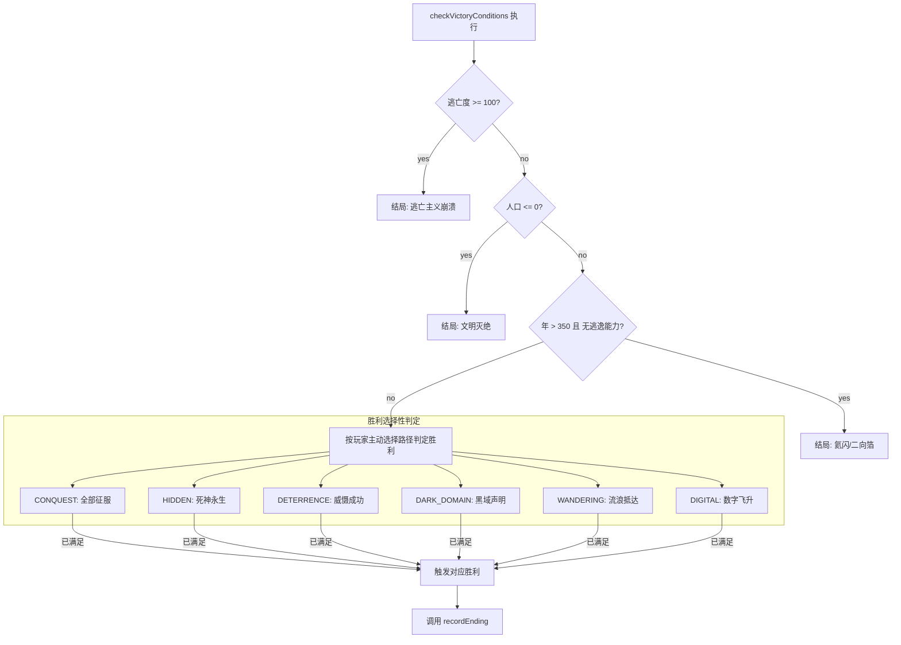

# 结局触发条件重设计规范

> 版本：v1.0  
> 日期：2026-06-15  
> 状态：设计方案（待实施）  
> 依赖审计报告：`AUDIT_20260615_ENDING_SYSTEM_AUDIT.md`

---

## 一、重设计原则

### 1.1 核心变更原则

| 原则 | 说明 |
|------|------|
| **科技+叙事双因子** | 每种胜利结局必须同时满足科技条件和叙事条件（flag/纪元/事件链），避免纯科技通关 |
| **统一出口** | 所有 game-over 路径必须经过 `checkVictoryConditions()`，消除绕过路径 |
| **严格逃逸** | 年 > 350 的氦闪逃逸必须基于实际逃生能力（科技），而非语义 flag |
| **唯一结局** | 同一回合内检查到多个结局条件时，按优先级硬规则选取，并在游戏内向玩家明确提示即将触发的结局 |
| **完整记录** | 所有结局结束路径必须调用 `SaveManager.recordEnding()` |
| **可达成性平衡** | 调整各结局难度梯度，确保既有易达成结局（流浪/数字），也有挑战结局（征服/隐藏） |

### 1.2 结局优先级总表



---

## 二、9 种结局条件重新设计

### 2.1 胜利结局（6 种）

---

#### ① WANDERING — 流浪胜利（推荐难度：★☆☆）

**设计思路**：作为"新手友好"结局，玩家通过完成流浪地球科技树即可达成。核心标志是地球抵达比邻星。

| 条件 | 当前 | 新设计 |
|------|------|--------|
| 科技 | 行星发动机Ⅲ型 + 新家园选址 | 行星发动机Ⅲ型 + 新家园选址 |
| 叙事 | （无） | flag `wandering_completed` set by PlanetEngine 推进终结事件 |
| 年限制 | 无 | 年 >= 250（流浪航程所需时间） |
| 额外 | （无） | 人口 > 0 (确保文明存活) |

```typescript
// 新检测逻辑
check: () => {
  const tm = this.earthCivi.tecTreeManager;
  return this.year >= 250 &&
         this.earthCivi.population > 0 &&
         tm.isTecFinished(TecTreeType.AEROSPACE, "行星发动机Ⅲ型") &&
         tm.isTecFinished(TecTreeType.INTERSTELLAR, "新家园选址") &&
         this.hasFlag("wandering_completed");
}
```

**消除绕过**: `wandering_chosen` flag **不再**作为氦闪逃逸条件。改为 WANDERING 胜利的前置条件之一。

---

#### ② DIGITAL — 数字永生（推荐难度：★★☆☆）

**设计思路**：需要数字方舟科技 + 足够多的上传人口，体现"全人类飞升"的概念。

| 条件 | 当前 | 新设计 |
|------|------|--------|
| 科技 | 数字方舟 | 数字方舟 |
| 叙事 | （无） | `hasFlag("digital_ark_upgrade")` — 升级数字方舟容纳上限 |
| 数值 | （无） | 人口 > 50（足够的意识上传） |
| 年限制 | 无 | 年 >= 200（建设时间） |

```typescript
check: () => {
  return this.year >= 200 &&
         this.earthCivi.population > 50 &&
         this.earthCivi.tecTreeManager.isTecFinished(TecTreeType.INFORMATION, "数字方舟") &&
         this.hasFlag("digital_ark_upgrade");
}
```

---

#### ③ DETERRENCE — 威慑胜利（推荐难度：★★★☆）

**设计思路**：执剑人维持长期威慑平衡，需要足够的威慑度持续一定回合数。

| 条件 | 当前 | 新设计 |
|------|------|--------|
| 纪元 | >= DETERRENCE | >= DETERRENCE |
| 执剑人 | 不为空 | 不为空 |
| 威慑度 | >= 80 | >= 90（更高要求） |
| 持续时间 | 无 | 威慑度 >= 80 持续至少 20 回合 |
| 人口 | > 0 | > 0 |
| 额外 | （无） | 所有异星文明未处于 `EXTINCTION_WAR`（真正和平） |

```typescript
check: () => {
  return this.epoch >= EpochType.DETERRENCE &&
         this.earthCivi.swordholder !== null &&
         this.earthCivi.population > 0 &&
         this.earthCivi.deterrenceValue >= 90 &&
         this.deterrenceEnduranceRounds >= 20 &&
         !this.alienCiviManager.hasAnyAtWar();
}
```

**新机制**: 新增 `deterrenceEnduranceRounds` 计数器，每回合威慑度 >= 80 时 +1，威慑度 < 80 时重置为 0。

---

#### ④ DARK_DOMAIN — 黑域胜利（推荐难度：★★★☆）

**设计思路**：不仅仅是完成科技，还需要实际选择和执行黑域生成决策。

| 条件 | 当前 | 新设计 |
|------|------|--------|
| 科技 | 黑域生成 | 黑域生成 |
| 叙事 | （无） | `hasFlag("dark_domain_decision")` — 通过事件确认执行黑域生成 |
| 年限制 | 无 | 年 >= 250 |
| 人口 | 无 | > 0 |
| 额外 | （无） | 期间未发生逃亡主义失控 (treachery < 80) |

```typescript
check: () => {
  return this.year >= 250 &&
         this.earthCivi.population > 0 &&
         this.earthCivi.tecTreeManager.isTecFinishedAnywhere("黑域生成") &&
         this.hasFlag("dark_domain_decision") &&
         this.earthCivi.treachery < 80;
}
```

---

#### ⑤ CONQUEST — 征服胜利（推荐难度：★★★★☆）

**设计思路**：真正征服所有异星文明，需要军事与纪律的双重制高点。

| 条件 | 当前 | 新设计 |
|------|------|--------|
| 军事征服 | isAllCiviConquered() | isAllCiviConquered() |
| 逃亡度 | 无 | 逃亡度 < 50（维持文明的战斗意志） |
| 人口 | 无 | > 10（还有文明的根基） |
| 叙事 | 无 | `hasFlag("conquest_declared")` — 通过事件宣布征服宣言 |
| 最短年 | 无 | 年 >= 200 |

```typescript
check: () => {
  return this.year >= 200 &&
         this.earthCivi.population > 10 &&
         this.earthCivi.treachery < 50 &&
         this.alienCiviManager.isAllCiviConquered() &&
         this.hasFlag("conquest_declared");
}
```

---

#### ⑥ HIDDEN — 死神永生·小宇宙（推荐难度：★★★★★）

**设计思路**：真正的"隐藏结局"，需要同时达成多项世界观成就，获取归零者信标。

| 条件 | 当前 | 新设计 |
|------|------|--------|
| 纪元 | >= GALAXY | >= GALAXY |
| 年 | >= 350 | >= 350 |
| 文化 | >= 800 | >= 1000（更高要求） |
| 人口 | > 0 | > 0 |
| 威慑 | >= 30 | >= 50 |
| 关键科技 | 黑域生成 OR 数字方舟 | 黑域生成 AND 数字方舟（两项都需要） |
| 关键flag | galaxy_exodus_seen + alien_alliance | galaxy_exodus_seen + alien_alliance + `zero_homer_contacted`（归零者接触事件） |
| 额外 | （无） | `hasFlag("mini_universe_built")` — 已建造小宇宙 |

```typescript
check: () => {
  return this.year >= 350 &&
         this.epoch >= EpochType.GALAXY &&
         this.earthCivi.culture >= 1000 &&
         this.earthCivi.population > 0 &&
         this.earthCivi.deterrenceValue >= 50 &&
         this.hasFlag("galaxy_exodus_seen") &&
         this.hasFlag("alien_alliance") &&
         this.hasFlag("zero_homer_contacted") &&
         this.hasFlag("mini_universe_built") &&
         this.earthCivi.tecTreeManager.isTecFinishedAnywhere("黑域生成") &&
         this.earthCivi.tecTreeManager.isTecFinishedAnywhere("数字方舟");
}
```

---

### 2.2 失败结局（3 种）

#### ⑦ TREACHERY — 逃亡主义崩溃

| 条件 | 当前 | 新设计（不变） |
|------|------|----------------|
| 触发 | 逃亡度 >= 100 | 逃亡度 >= 100 |
| 记录 | ✅ 调用 recordEnding | ✅（保持） |

---

#### ⑧ EXTINCTION — 文明灭绝

| 条件 | 当前 | 新设计 |
|------|------|--------|
| 触发 | 人口 <= 0 | 人口 <= 0（必须通过 checkVictoryConditions 触发，消除 sanitizeResources 的绕过） |
| 记录 | ✅ 在 checkVictoryConditions 中 | ✅（保持） |
| 绕过 | sanitizeResources 直接 dispatch game-over | **修复**: sanitizeResources 不 dispatch game-over，改由 checkVictoryConditions 处理 |

---

#### ⑨ HELIUM_FLASH — 太阳氦闪 / 二向箔打击

| 条件 | 当前（问题） | 新设计（修复） |
|------|-------------|----------------|
| 触发条件 | year > 350 AND 无黑域 AND 无数字方舟 AND 无 `dimensional_defense` AND 无 `wandering_chosen` | year > 350 AND 无黑域科技 AND 无数字方舟科技 AND `dimensionStrikeTriggered`（由事件/维度打击统一设置） |
| `wandering_chosen` | **❌ 错误作为逃逸条件** | **移除** — 流浪路线不能逃逸氦闪，必须完成真正科技 |
| `dimensional_defense` | **❌ 从未实际设置** | **移除** — 改为由事件设置 `dimensional_defense_completed`，需要实际完成相应科技 |
| `processDimensionStrike` | **❌ 绕过** | **修复**: 只在 alien 设置 flag `dimensionStrikeTriggered = true`，由 `checkVictoryConditions()` 统一检测并触发结局 |

```typescript
// 新检测逻辑
if (this.year > 350 && 
    !this.earthCivi.tecTreeManager.isTecFinishedAnywhere("黑域生成") && 
    !this.earthCivi.tecTreeManager.isTecFinishedAnywhere("数字方舟") &&
    !this.hasFlag("dimensional_defense_completed") &&
    !this.hasFlag("wandering_completed")) {
  // 触发氦闪/二向箔结局
}
```

---

## 三、game-over 路径统一化改造

### 3.1 当前问题路径 vs 新设计

| 触发点 | 当前行为 | 新设计行为 |
|--------|---------|-----------|
| `EarthCivilization.sanitizeResources()` (人口归零) | 直接 dispatch `game-over`，不设 defeatType | **移除 game-over 逻辑**，只设 population = 0，由 `checkVictoryConditions()` 统一处理 |
| `AlienCivilization.processDimensionStrike()` (二向箔打击) | 直接设 `isGameOver = true` + dispatch | 只设 flag `dimensionStrikeTriggered = true` + `dimensionStrikeYear = year`，由 `checkVictoryConditions()` 统一处理 |
| `WallfacerPanel` 广播按钮 | 硬编码 `victoryType = 5` / `defeatType = 1`，直接设 game-over | 设置 flag `broadcast_triggered = true` + `broadcastSurvives` 状态，由 `checkVictoryConditions()` 统一处理 |
| `processDimensionStrike` 中设 defeatType = 2 | 混淆（2 是 HELIUM_FLASH 但这里实际是二向箔灭绝） | 统一 == 设为 `DefeatType.HELIUM_FLASH`，或者增加 `DefeatType.DIMENSION_STRIKE = 3` |

### 3.2 新流程

```
runARound()
  ├── earthCivi.runARound() → population may drop to 0 (no game-over dispatch)
  ├── alienCiviManager.runARound() → may set dimensionStrikeTriggered flag
  ├── checkVictoryConditions()
  │     ├── 检查逃亡度 >= 100 → TREACHERY
  │     ├── 检查人口 <= 0 → EXTINCTION
  │     ├── 检查 dimensionStrikeTriggered + 年>350 + 无逃逸科技 → HELIUM_FLASH
  │     ├── broadcast_triggered + 存活判断 → HIDDEN (存活) / EXTINCTION (死亡)
  │     ├── 征服所有异星 → CONQUEST
  │     ├── 隐藏结局条件 → HIDDEN
  │     ├── 威慑条件 → DETERRENCE
  │     ├── 黑域条件 → DARK_DOMAIN
  │     ├── 流浪条件 → WANDERING
  │     └── 数字飞升条件 → DIGITAL
  └── 记录结局 (全部经过 SaveManager.recordEnding)
```

---

## 四、新增与修改系统参数

### 4.1 新增 DefeatType

```typescript
export enum DefeatType {
  TREACHERY = 0,
  EXTINCTION = 1,
  HELIUM_FLASH = 2,
  DIMENSION_STRIKE = 3,  // 新增：二向箔降维打击（与氦闪区分）
}
```

### 4.2 新增 game 状态字段

```typescript
// Game.ts 新增
public deterrenceEnduranceRounds: number = 0;  // 威慑维持回合计数器
public dimensionStrikeTriggered: boolean = false;  // 是否已触发二向箔打击
public dimensionStrikeYear: number = 0;  // 二向箔打击触发年份
public broadcastTriggered: boolean = false;  // 是否已执行坐标广播
public broadcastSurvives: boolean = false;  // 坐标广播后文明是否存活
```

### 4.3 新增 / 修改 flag 清单

| Flag | 归属 | 设置时机 | 用于 |
|------|------|---------|------|
| `wandering_chosen` | 保留（修改语义） | 流浪地球事件中选择路线 | 前置标记，不再作为逃逸条件 |
| `wandering_completed` | 修改 | PlanetEngine 流浪完成时 | WANDERING 胜利条件 |
| `dimensional_defense_completed` | **新增** | 维度防御科技/事件完成时 | 氦闪逃逸条件 |
| `digital_ark_upgrade` | **新增** | 数字方舟升级事件 | DIGITAL 胜利条件 |
| `dark_domain_decision` | **新增** | 黑域生成决策事件 | DARK_DOMAIN 胜利条件 |
| `conquest_declared` | **新增** | 征服宣言事件 | CONQUEST 胜利条件 |
| `zero_homer_contacted` | **新增** | 归零者接触事件 | HIDDEN 胜利条件 |
| `mini_universe_built` | **新增** | 小宇宙建造事件 | HIDDEN 胜利条件 |
| `broadcast_triggered` | **新增** | WallfacerPanel 广播 | 统一 game-over 路径 |
| `dimension_strike_triggered` | **新增** | AlienCivilization 维度打击 | 统一 game-over 路径 |

---

## 五、实施路线图

### Phase 1 — 核心修复（建议 1 个迭代）

1. `checkVictoryConditions()` 添加 `isGameOver` 前置守卫（避免重复触发）
2. `sanitizeResources()` 移除 game-over 直接调度
3. `processDimensionStrike()` 改为只设 flag
4. `WallfacerPanel` 改为设 flag + 移除直接调度
5. 更新氦闪逃逸条件（移除 `wandering_chosen` 和 `dimensional_defense`）
6. 补充 `dimensional_defense_completed` flag 设置事件

### Phase 2 — 条件增强（建议 1-2 个迭代）

1. 添加 DETERRENCE 回合计数器
2. 为 WANDERING/DIGITAL/DARK_DOMAIN/CONQUEST/HIDDEN 添加新 flag 要求
3. 调整各结局难度梯度
4. 添加 `DefeatType.DIMENSION_STRIKE`

### Phase 3 — 叙事事件补充（建议 1-2 个迭代）

1. 新增归零者接触事件链
2. 新增小宇宙建造事件链
3. 新增征服宣言事件
4. 新增黑域生成决策事件
5. 新增数字方舟升级事件

---

## 六、附录：条件变更前后对比总表

| 结局 | 当前条件数 | 新条件数 | 难度变更 | 主要变更 |
|------|-----------|---------|---------|---------|
| WANDERING | 2 | 4 | ↑ 略增 | 加入年限制 + `wandering_completed` |
| DIGITAL | 1 | 4 | ↑↑ 提升 | 加入年限制 + 人口 + `digital_ark_upgrade` |
| DETERRENCE | 4 | 6 | ↑ 略增 | 加入回合计数器 + 外交约束 |
| DARK_DOMAIN | 1 | 4 | ↑↑ 提升 | 加入年限制 + `dark_domain_decision` + 逃亡约束 |
| CONQUEST | 1 | 5 | ↑↑ 显著提升 | 加入年限制 + 逃亡约束 + `conquest_declared` |
| HIDDEN | 8 | 11 | ↑ 略增 | 加入 `zero_homer_contacted` + `mini_universe_built` |
| TREACHERY | 1 | 1 | — 不变 | — |
| EXTINCTION | 1 | 1 | — 不变 | 统一出口 |
| HELIUM_FLASH | 5 | 5 | ± 调整 | 移除语义 flag，替换为实际能力 flag |

---

> 文档版本：v1.0  
> 基于审计报告 `AUDIT_20260615_ENDING_SYSTEM_AUDIT.md` 中发现的 7 类问题设计  
> 下一阶段：完善单元测试方案 → 实施代码变更